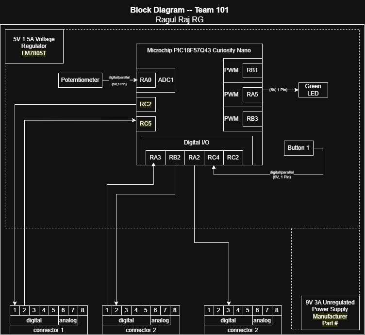

## Overview
The subsystem provides user input and output feedback through two buttons, two LEDs, and a potentiometer. The buttons act as digital inputs, the LEDs serve as visual indicators, and the potentiometer provides an adjustable analog input for control functions.

All components operate on a regulated 5V, 1.5A supply from an LM7805T voltage regulator, powered by a 9V, 3A unregulated source. The central controller is the Microchip PIC18F57Q43 Curiosity Nano, which manages logic, inputs, and outputs. The potentiometer connects to RA0 via ADC1, the red and green LEDs connect to RB1 and RB2 using PWM, and the buttons connect to RC2 and RB3 as digital inputs.

At the bottom of the diagram, two 8-pin connectors link this subsystem to others within the project. These connectors carry both digital and analog signals for inter-subsystem communication. 

## Block Diagram 

