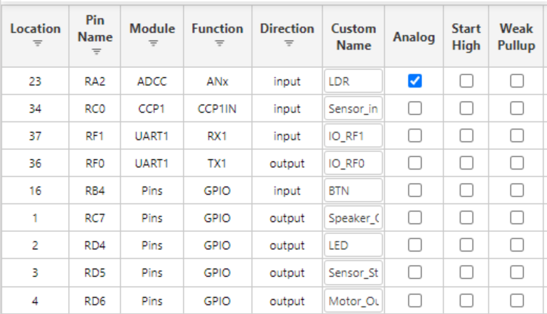

**LDR**

1. Advanced Photonix PDV-P9203

    

    * $1.5/each
    * [link to product](https://www.digikey.com/en/products/detail/adafruit-industries-llc/161/7244927)

    | Pros                                      | Cons                                                             |
    | ----------------------------------------- | ---------------------------------------------------------------- |
    | Has a specified resistance of 10 kΩ to 30 kΩ at ~10 lux.| Response (rise time) is relatively slow: typ ~70 ms. |
    | Good light sensitivity range (visible light around 570 nm)|         

2. Adafruit CDS Photoresistor

    

    * $0.9/each
    * [Link to product](https://www.digikey.com/en/products/detail/advanced-photonix/PDV-P9203/480628)

    | Pros                                                              | Cons                |
    | ----------------------------------------------------------------- | ------------------- |
    | Pros	Cons
    |Very low resistance in light. gives strong variation.|More resources compared to Advanced Photonix PDV-P9203    |
    |Inexpencive|

**Choice:** Option 2: Adafruit CDS Photoresistor

**Rationale:** Clear Light vs Dark discrimination, Low cost, Simple integration.

**OP-AMP**

1. Microchip MCP6004-I/P

    

    * $1.5/each
    * [link to product](https://www.digikey.com/en/products/detail/microchip-technology/MCP6004-I-P/523060)

    | Pros                                      | Cons                                                             |
    | ----------------------------------------- | ---------------------------------------------------------------- |
    | easier to use with 3.3 V MCUs and single-supply designs.| Lower drive current than LM324 |
    | Fits the scope of this class.|         

2. Texas Instruments LM324N

    

    * $0.47/each
    * [Link to product](https://www.digikey.com/en/products/detail/texas-instruments/LM324N/277627)

    | Pros                                                              | Cons                |
    | ----------------------------------------------------------------- | ------------------- |
    | Very cheap and widely available
    |Very low resistance in light. gives strong variation.|Not rail-to-rail; output won’t swing to VCC, which complicates 3.3 V MCU interfacing.    |
    |Inexpencive|

**Choice:** Option 1: Microchip MCP6004-I/P.

**Rationale:** The MCP6004 is ideal because it’s rail-to-rail, low-power, and perfectly suited for accurate 3.3 V sensor interfacing in your lawn-watering system.

**Voltage Regulator**

1. LM7805T Linear Voltage Regulator

    

    * $0.33/each
    * [link to product](https://www.digikey.com/en/products/detail/taejin/LM7805T/22237260)

    | Pros                                      | Cons                                                             |
    | ----------------------------------------- | ---------------------------------------------------------------- |
    | Inexpensive	| Inefficient, heat dissipation at higher voltage difference |
    | Output Current 1.5A	|         

2. MC7805CT-BP Linear Voltage Regulator

    

    * $0.75/each
    * [Link to product](https://www.digikey.com/en/products/detail/mcc-micro-commercial-components/MC7805CT-BP/804682)

    | Pros                                                              | Cons                |
    | ----------------------------------------------------------------- | ------------------- |
    | Inexpensive|Higher Input Voltage (25 V)
    |Output Current 1.5A| Not provided in the Lab Kit

**Choice:** Option 1: MC7805CT-BP Linear Voltage Regulator

**Rationale:** The LM7805T regulator is included in the lab kit, which helps reduce the budget, shipment time and is good enough for my use case.

## Summary Table

**Table 1: Summary Table of Final Major Components Selected**

| Component Type | Selected Option | Price | Key Reason for Selection |
|----------------|-----------------|-------|--------------------------|
| Op-Amp | MCP6004-I/P Rail-to-Rail Op-Amp | $1.50 | Rail-to-rail operation, low-power, ideal for 3.3V sensor interfacing |
| Photoresistor | Adafruit CDS Photoresistor | $0.90 | Clear light vs dark discrimination, low cost, simple integration |
| Voltage Regulator | MC7805CT-BP Linear Voltage Regulator | $0.75 | Lab kit part, easy to order, adequate performance |

## MCC Pin Configuration

The image above shows my MCC pin configuration. I am using ADC to read values from potentiometer and LDR, and I am using the capture function of CCP to capture PWM signal from the moisture sensor subsystem. UART is used for debugging and displaying results on data visualizer in MCC, and everything else is GPIO.

