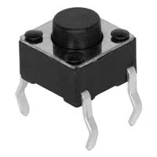

### Style 2

**Push Button**

1. TS02-66-50-BK-100-LCR-D -- Push Button

    

    * $0.1/each
    * [link to product](https://www.digikey.com/en/products/detail/same-sky-formerly-cui-devices-/TS02-66-50-BK-100-LCR-D/15634294?gclsrc=aw.ds&gad_source=1&gad_campaignid=20243136172&gbraid=0AAAAADrbLlhjMd1SI_TeFQt_5_XtjL5xo&gclid=CjwKCAjw0sfHBhB6EiwAQtv5qTL9B8Ibio6YzZwawgjQTTJfZOm_s9jRh1qKtTfUlaCdgvFL-coORxoCgQgQAvD_BwE)

    | Pros                                      | Cons                                                             |
    | ----------------------------------------- | ---------------------------------------------------------------- |
    | Cheap                               | No Dust Protection |
    | Good Operating Temperature                      | No Water Protection                                        |
    | Meets surface mount constraint of project |

1. CTX936TR-ND surface mount oscillator

    

    * $1/each
    * [Link to product](http://www.digikey.com/product-detail/en/636L3I001M84320/CTX936TR-ND/2292940)

    | Pros                                                              | Cons                |
    | ----------------------------------------------------------------- | ------------------- |
    | Cheap                                                             | More expensive      |
    | Stable over operating temperature                                 | Slow shipping speed |
    | Direct interface with PSoC (no external circuitry required) range |

**Choice:** Option 2: CTX936TR-ND surface mount oscillator

**Rationale:** A clock oscillator is easier to work with because it requires no external circuitry in order to interface with the PSoC. This is particularly important because we are not sure of the electrical characteristics of the PCB, which could affect the oscillation of a crystal. While the shipping speed is slow, according to the website if we order this week it will arrive within 3 weeks.
