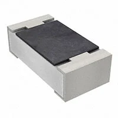
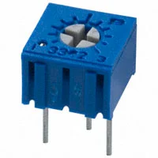

>My subsystem is primarily software-oriented, with limited hardware components. As a result, there were few physical sensors or actuators to include in the component selection. For this reason, I listed the push button and LED under the component selection section. 

**Push Button**

1. TS02-66-50-BK-100-LCR-D -- Push Button

    

    * $0.1/each
    * [link to product](https://www.digikey.com/en/products/detail/same-sky-formerly-cui-devices-/TS02-66-50-BK-100-LCR-D/15634294?gclsrc=aw.ds&gad_source=1&gad_campaignid=20243136172&gbraid=0AAAAADrbLlhjMd1SI_TeFQt_5_XtjL5xo&gclid=CjwKCAjw0sfHBhB6EiwAQtv5qTL9B8Ibio6YzZwawgjQTTJfZOm_s9jRh1qKtTfUlaCdgvFL-coORxoCgQgQAvD_BwE)

    | Pros                                      | Cons                                                             |
    | ----------------------------------------- | ---------------------------------------------------------------- |
    | Cheap                               | No Dust Protection |
    | Good Operating Temperature                      | No Water Protection                                        |
    | Meets surface mount constraint of project |

2. C&K D6 Series Keyswitch

    

    * $1.6/each
    * [Link to product](https://www.digikey.com/en/products/detail/c-k/D6R10-F2-LFS/1466347)

    | Pros                                                              | Cons                |
    | ----------------------------------------------------------------- | ------------------- |
    | Cheap                                                             | More expensive      |
    | Good Operating Temperature                                 | Not Water Resistant|
    |More Tactile/Better Quality|

3. SW-PB11-4CSKG-10 Push Button
 
    

    * $6.43/each
    * [Link to product](https://www.digikey.com/en/products/detail/adam-tech/SW-PB11-4CSKG-10/14635466?utm_source=Perplexity&utm_medium=referral)

    | Pros                                                              | Cons                |
    | ----------------------------------------------------------------- | ------------------- |
    | Dust Proof                                                             | Expensive      |
    | Water Proof                                 
    |Heavy Duty|

**Choice:** Option 2: C&K D6 Series Keyswitch   

**Rationale:** Since adjacent components in the product also require protection, we must use an enclosure for the entire assembly. This makes the IP67 rating of Option 3 redundant. By using a single enclosure, we can use the higher-quality C&K switch, which offers superior tactile feedback and a much longer 250,000-cycle life, providing better reliability.

**Pull Down Resistor**

1. 10K Ohm SMD Resistor

    

    * $0.1/each
    * [link to product](https://www.digikey.com/en/products/detail/same-sky-formerly-cui-devices-/TS02-66-50-BK-100-LCR-D/15634294?gclsrc=aw.ds&gad_source=1&gad_campaignid=20243136172&gbraid=0AAAAADrbLlhjMd1SI_TeFQt_5_XtjL5xo&gclid=CjwKCAjw0sfHBhB6EiwAQtv5qTL9B8Ibio6YzZwawgjQTTJfZOm_s9jRh1qKtTfUlaCdgvFL-coORxoCgQgQAvD_BwEhttps://www.digikey.com/en/products/detail/yageo/RC0603FR-0710KL/726880)

    | Pros                                      | Cons                                                             |
    | ----------------------------------------- | ---------------------------------------------------------------- |
    | Smaller Form Factor                               | Difficult to Hand Solder |
    | Moisture Resistant                 
    | Meets surface mount constraint of project |

2. 10K Ohm THT Resistor

    

    * $0.1/each
    * [Link to product](https://www.digikey.com/en/products/detail/stackpole-electronics-inc/CF14JA10K0/21720224?gclsrc=aw.ds&gad_source=1&gad_campaignid=20682878391&gbraid=0AAAAADrbLlgbcuo_fYsHwsmmzciY1a4iV&gclid=CjwKCAjw0sfHBhB6EiwAQtv5qe8kMZm3tYG9zKv_h9EisWxUUe3a8mT-ah0_GFUkHc7hP42Tdb7hGRoCVeYQAvD_BwE)

    | Pros                                                              | Cons                |
    | ----------------------------------------------------------------- | ------------------- |
    | Easy to Solder & Prototype                                                             |Large   |
    | Good Operating Temperature                                 
    |Easy to Repair/Replace|

**Choice:** Option 2: 10K Ohm THT Resistor

**Rationale:** We're using a THT resistor. For a simple RC debounce filter, the miniaturization and high-frequency benefits of SMD are unnecessary, while the durability and ease of soldering of a THT resistor are major advantages for reliability and servicing.

**LDR**

1. Advanced Photonix PDV-P9203

    

    * $1.5/each
    * [link to product](https://www.digikey.com/en/products/detail/adafruit-industries-llc/161/7244927)

    | Pros                                      | Cons                                                             |
    | ----------------------------------------- | ---------------------------------------------------------------- |
    | Has a specified resistance of 10 kΩ to 30 kΩ at ~10 lux.| Response (rise time) is relatively slow: typ ~70 ms. |
    | Good light sensitivity range (visible light around 570 nm)|         

2. Adafruit CDS Photoresistor

    

    * $0.9/each
    * [Link to product](https://www.digikey.com/en/products/detail/advanced-photonix/PDV-P9203/480628)

    | Pros                                                              | Cons                |
    | ----------------------------------------------------------------- | ------------------- |
    | Pros	Cons
    |Very low resistance in light. gives strong variation.|More resources compared to Advanced Photonix PDV-P9203    |
    |Inexpencive|

**Choice:** Option 2: Adafruit CDS Photoresistor

**Rationale:** Clear Light vs Dark discrimination, Low cost, Simple integration.

**OP-AMP**

1. Microchip MCP6004-I/P

    

    * $1.5/each
    * [link to product](https://www.digikey.com/en/products/detail/microchip-technology/MCP6004-I-P/523060)

    | Pros                                      | Cons                                                             |
    | ----------------------------------------- | ---------------------------------------------------------------- |
    | easier to use with 3.3 V MCUs and single-supply designs.| Lower drive current than LM324 |
    | Fits the scope of this class.|         

2. Texas Instruments LM324N

    

    * $0.47/each
    * [Link to product](https://www.digikey.com/en/products/detail/texas-instruments/LM324N/277627)

    | Pros                                                              | Cons                |
    | ----------------------------------------------------------------- | ------------------- |
    | Very cheap and widely available
    |Very low resistance in light. gives strong variation.|Not rail-to-rail; output won’t swing to VCC, which complicates 3.3 V MCU interfacing.    |
    |Inexpencive|

**Choice:** Option 1: Microchip MCP6004-I/P
**Rationale:** The MCP6004 is ideal because it’s rail-to-rail, low-power, and perfectly suited for accurate 3.3 V sensor interfacing in your lawn-watering system.

**LED**

1. LTST-C170GKT - SMD LED

    

    * $0.1/each
    * [link to product](https://www.digikey.com/en/products/detail/same-sky-formerly-cui-devices-/TS02-66-50-BK-100-LCR-D/15634294?gclsrc=aw.ds&gad_source=1&gad_campaignid=20243136172&gbraid=0AAAAADrbLlhjMd1SI_TeFQt_5_XtjL5xo&gclid=CjwKCAjw0sfHBhB6EiwAQtv5qTL9B8Ibio6YzZwawgjQTTJfZOm_s9jRh1qKtTfUlaCdgvFL-coORxoCgQgQAvD_BwE)

    | Pros                                      | Cons                                                             |
    | ----------------------------------------- | ---------------------------------------------------------------- |
    | Cheap                               | Extremely Small |
    | Wide Viewing Angle                       | SMD                                        |

2. 151051RS11000 - THT LED

    

    * $0.15/each
    * [Link to product](https://www.digikey.com/en/products/detail/w-rth-elektronik/151051RS11000/4490012?gclsrc=aw.ds&gad_source=1&gad_campaignid=20228387720&gbraid=0AAAAADrbLlgDBce-yW0NxfO-Ob4qZ3vYc&gclid=CjwKCAjw0sfHBhB6EiwAQtv5qefY9cZibBmWByq1iOIOMS7wTNOeG6vDpariQ8GL5ejDJzHyzCcToRoCz6sQAvD_BwE)

    | Pros                                                              | Cons                |
    | ----------------------------------------------------------------- | ------------------- |
    | THT                                                             | More expensive      |
    | Highly Visible                            | Fragile|

3. L65DR12L - Pilot Panel Light
 
    

    * $3.75/each
    * [Link to product](https://www.digikey.com/en/products/detail/visual-communications-company-vcc/L65DR12L/6166300?gclsrc=aw.ds&gad_source=1&gad_campaignid=20228387720&gbraid=0AAAAADrbLlgDBce-yW0NxfO-Ob4qZ3vYc&gclid=CjwKCAjw0sfHBhB6EiwAQtv5qR5vGshBwh-8JN3RyWXDJwwFqjLhzi-i4aZ8F2Z6iBGFRKPGzl7QPBoCdM0QAvD_BwE)

    | Pros                                                              | Cons                |
    | ----------------------------------------------------------------- | ------------------- |
    | Dust Proof                                                             | Expensive      |
    | Water Proof                                 
    |Heavy Duty|

**Choice:** Option 2: 51051RS11000 - THT LED

**Rationale:** We're selecting Option 2 (THT LED). It avoids the difficult manual soldering of the SMD (Option 1) and the unnecessary cost and complexity of the panel-mount (Option 3). Option 2 is the simplest, most cost-effective choice for our manual assembly process.

**LED Resistor**

1. 220 Ohm SMD Resistor

    

    * $0.1/each
    * [link to product](https://www.digikey.com/en/products/detail/stackpole-electronics-inc/RHC2512FT220R/1646043)

    | Pros                                      | Cons                                                             |
    | ----------------------------------------- | ---------------------------------------------------------------- |
    | Smaller Form Factor                               | Difficult to Hand Solder |
    | Moisture Resistant                 
    | Meets surface mount constraint of project |

2. 220 Ohm THT Resistor

    

    * $0.1/each
    * [Link to product](https://www.digikey.com/en/products/detail/stackpole-electronics-inc/CF14JT220R/1830334?gclsrc=aw.ds&gad_source=1&gad_campaignid=20682878391&gbraid=0AAAAADrbLlgbcuo_fYsHwsmmzciY1a4iV&gclid=CjwKCAjw0sfHBhB6EiwAQtv5qSPeXHx2WBbg3rgop8kynSdb2YdtY_4OGnXGOXnpnqN0DCFsshwHphoCvekQAvD_BwE)

    | Pros                                                              | Cons                |
    | ----------------------------------------------------------------- | ------------------- |
    | Easy to Solder & Prototype                                                             |Large   |
    | Good Operating Temperature                                 
    |Easy to Repair/Replace|

**Choice:** Option 2: 220K Ohm THT Resistor

**Rationale:** We're using a THT resistor. For a LED Resistor, the miniaturization and high-frequency benefits of SMD are unnecessary, while the durability and ease of soldering of a THT resistor are major advantages for reliability and servicing.

**Potentiometer**

1. PDB181-K420K-504A2

    

    * $1.3/each
    * [link to product](https://www.digikey.com/en/products/detail/bourns-inc/PDB181-K420K-504A2/699763?gclsrc=aw.ds&gad_source=1&gad_campaignid=20243136172&gbraid=0AAAAADrbLliFVtbptKHwxHXZOLTZ9Dngt&gclid=CjwKCAjw0sfHBhB6EiwAQtv5qbNUYy_icEqKEJR9YgyaVWl__seyFz5mLP7zNynW1Lc2milzz8UQExoCa_MQAvD_BwE)

    | Pros                                      | Cons                                                             |
    | ----------------------------------------- | ---------------------------------------------------------------- |
    | easy to use                | Easy to tamper with |
    | easy to work with| SMD                                        |

2. 3362P-1-103LF

    

    * $0.91/each
    * [Link to product](https://www.digikey.com/en/products/detail/bourns-inc/3362P-1-103LF/1088412)

    | Pros                                                              | Cons                |
    | ----------------------------------------------------------------- | ------------------- |
    | Cheaper                                                          | Designed for internal use      |
    | designed to hold its setting                           | Fragile|

**Choice:** Option 2: 3362P-1-103LF

**Rationale:** We're selecting the trimpot, because it mounts internally. This prevents user tampering and ensures the settings remains the same.