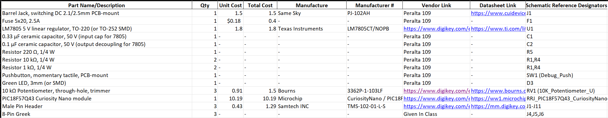

## Overview
Below is the bill of materials for my PCB design, which includes the power regulation stage, user-interface components, connectors, and the PIC18F57Q43 Curiosity Nano module used as the system’s microcontroller. Many of the passive components can be sourced directly from Peralta 109, while specialty items such as the voltage regulator, potentiometer, and headers are ordered through Digi-Key. Pin headers and the onboard pushbutton are included to support debugging and flexible testing during development. Most parts carry minimal or no cost, with the Curiosity Nano and a few ordered components making up the majority of expenses. Even when accounting for extra units of key parts for testing, the overall cost remains well within the project’s budget requirements.

## Bill of Materials Example (as Image)
{style width: "2000"}

## Resouces
The BOM as a xlsx download is available [*here*](BOM_Circuit.xlsx)