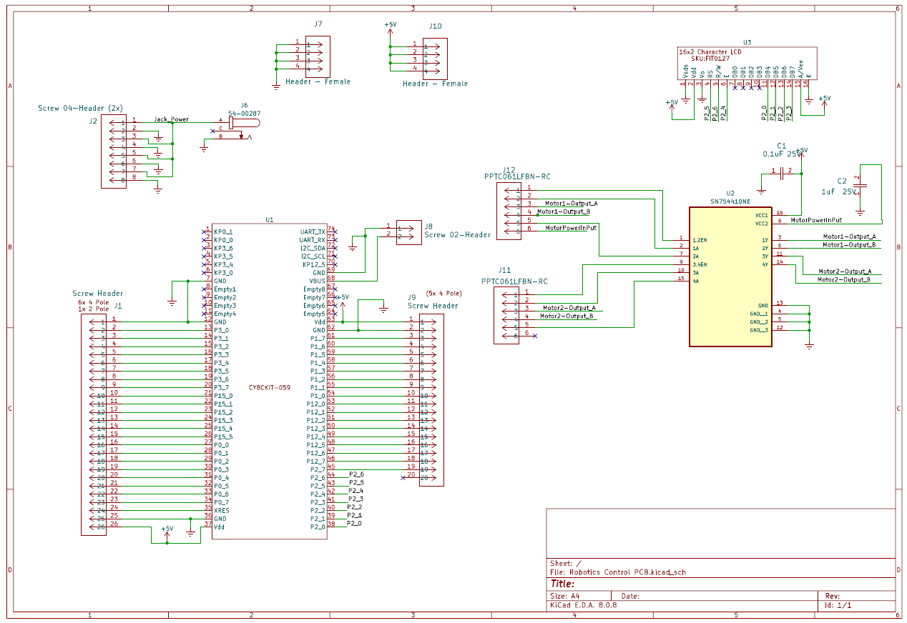

## Overview

This schematic shows the central hub board for a water sprinkler system, controlled by a PIC microcontroller. It's designed to receive user inputs (via a button/potentiometer) and data from a sensor board, while sending control signals to separate motor and speaker boards.

{style width:"350" height:"300;"}
**Figure 01:** Figure showing the hub schematic.

## Resouces

The schematic as a PDF download is available [*here*](Individual-subsystem.pdf), and the Zip folder of the project [*here*](Individual-subsystem.zip).