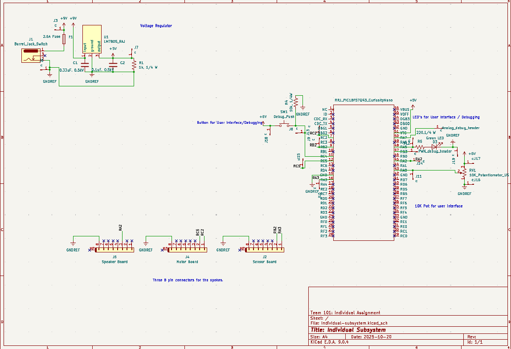

## Overview

This schematic shows the central hub board for a water sprinkler system controlled by a PIC18. MCC configures ADCC for analog inputs from the potentiometer and the sensor board, GPIO with Interrupt-on-Change for the push button and other digital signals, and EUSART/UART for inter-board data exchange. Motor and speaker control use GPIO and PWM/CCP. The board includes three 8-pin connectors for interfacing with other subsystem boards, providing both power and communication lines. A 5 V, 1.5 A voltage regulator supplies the system from a 9 V, 3 A input source. For debugging, header pins are available on the analog and digital PWM outputs, along with multiple test points distributed across the board. An onboard LED and push button support debugging and status indication, and a fuse is integrated for safety and overcurrent protection.

{style width:"350" height:"300;"}
**Figure 01:** Figure showing the hub schematic.

## Resouces

The schematic as a PDF download is available [*here*](Individual-subsystem.pdf), and the Zip folder of the project [*here*](Individual-subsystem.zip).