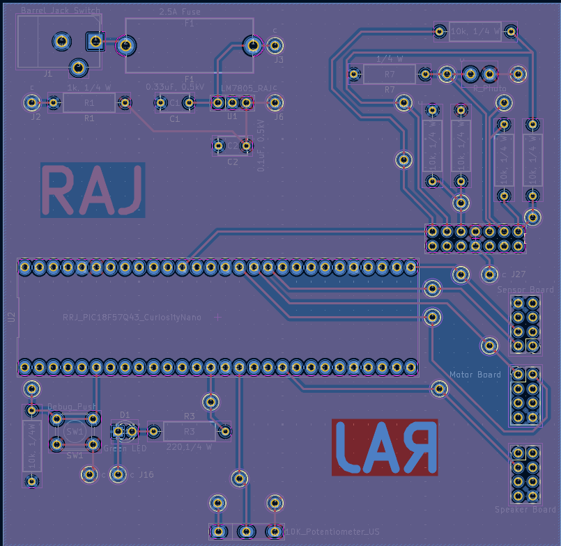

## Overview

This PCB serves as the central hub for a PIC18-based water sprinkler system. It includes an LM7805 regulator supplying 5 V / 1.5 A from a 9 V input with fuse protection. The PIC18F57Q43 Curiosity Nano interfaces with analog inputs (potentiometer and sensors), digital I/O for push buttons, and PWM outputs for motor and speaker control. Three 8-pin connectors provide power and communication to subsystem boards. Debugging features include an onboard LED, push button, test points, and accessible headers, with ground planes for signal stability and integrated overcurrent protection.

{style width:"350" height:"300;"}
**Figure 01:** Figure showing top PCB layer.

{style width:"350" height:"300;"}
**Figure 02:** Figure showing bottom PCB layer.

{style width:"350" height:"300;"}
**Figure 03:** Figure showing manufactured and soldered PCB top layer.

{style width:"350" height:"300;"}
**Figure 04:** Figure showing manufactured and soldered PCB bottom layer.

{style width:"350" height:"300;"}
**Figure 05:** Figure showing blank (unpopulated) PCB top layer.

{style width:"350" height:"300;"}
**Figure 06:** Figure showing blank (unpopulated) PCB bottom layer.

## Resouces

The PCB design as a PDF download is available here - [*top*](invidual-subsystem-pcb-top.pdf),[*bottom*](invidual-subsystem-pcb-bottom.pdf),The DRC Check PDF [*here*](Individual-subsystem-Final-Check-Files.pdf), The JLC DFM Check [*here*](invidual-subsystem-pcb-jlc-check.pdf) and the Gerber Zip folder of the project [*here*](RagulRaj101.zip).