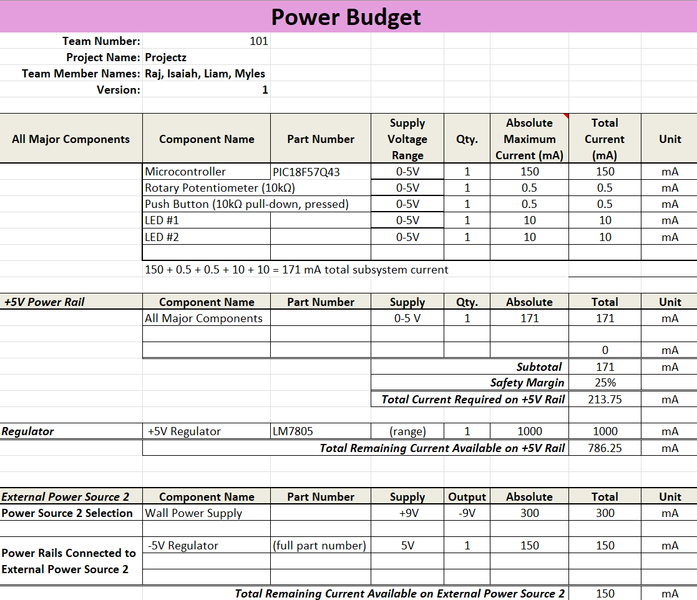

## Overview
The power budget was created to estimate the total power consumption of the system, ensuring that the 5V regulator and power supply can safely support all components under normal and peak conditions. Each device’s voltage, current, and power were calculated and summed, with a 25% safety margin added to account for variations. This confirmed that the regulator’s 1500 mA capacity provides ample headroom. Heat dissipation was also evaluated, showing that a linear regulator (9→5V) would lose about 0.86 W, while a switching regulator would lose only 0.12 W. Overall, the power budget ensures reliability, efficiency, and proper power management in the circuit design.

> Capture your power budge as a image to display. Take time to get clean breaks and a well organized layout.

## Conclusions

The power budget shows that the system draws about 214 mA and 1.07 W with margin, well below the regulator’s 1500 mA limit. Both linear and switching regulators can handle the load, though switching offers better efficiency. Overall, the design is safe, efficient, and leaves plenty of headroom for expansion.

## Resouces

The power budget as a PDF download is available [*here*](PowerBudgetpdf.pdf), and a Microsoft Excel Sheet [*here*](PowerBudgetexcel.xlsx).